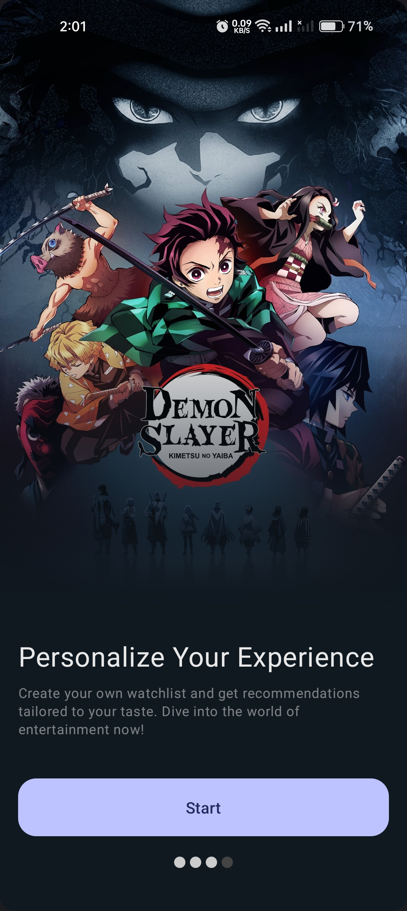
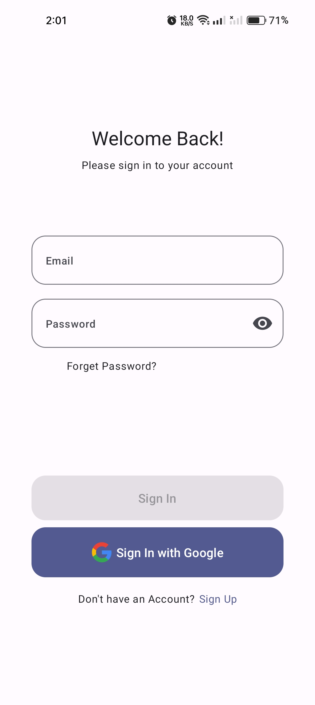
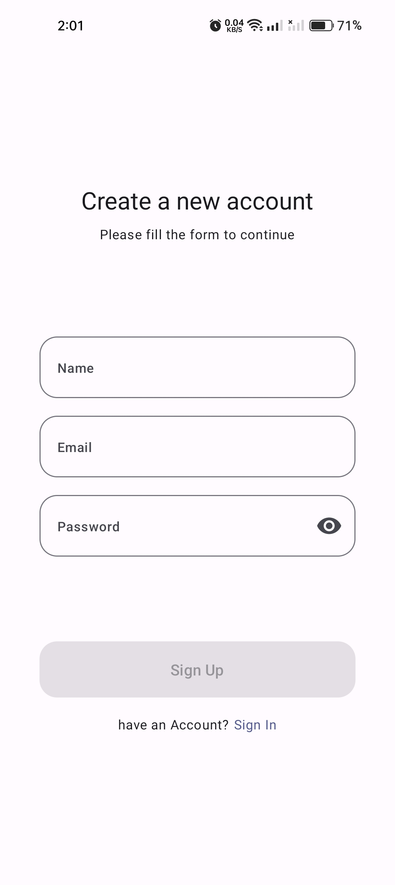

<h1 align="center">Show Magnet</h1>

<p align="center">  
Movie is an application based on modern Android tech-stacks especially focus on Jetpack Compose UI using The Movie DB API. Also fetching data from the network and integrating persisted data using Room.
</p>

## Tech stack

- 100% Kotlin based
- Coroutines & Flow
- Hilt dependency injection library
- Jetpack Compose
- The Movie DB API
- Firebase
  - Auth
  - Firestore
  - Storage
- JetPack
  - Compose
  - ViewModel
  - Lifecycle
  - Room
- Material Design & Animations
- Retrofit2 & Gson
- OkHttp3
- Coin
- Accompanist

## Architecture
- Clean Arch
- MVI Architecture
- Repository pattern

## How to build on your environment
Add your [TMDB access token](https://www.themoviedb.org/settings/api) in local.properties file.
```
access_token=YOUR_ACCESS_TOKEN
```
Add Create [a firebase projects](https://console.firebase.google.com/) and add `google-services.json` file

## Preview
### On boarding
 
 


### Auth




### Main


### Details

